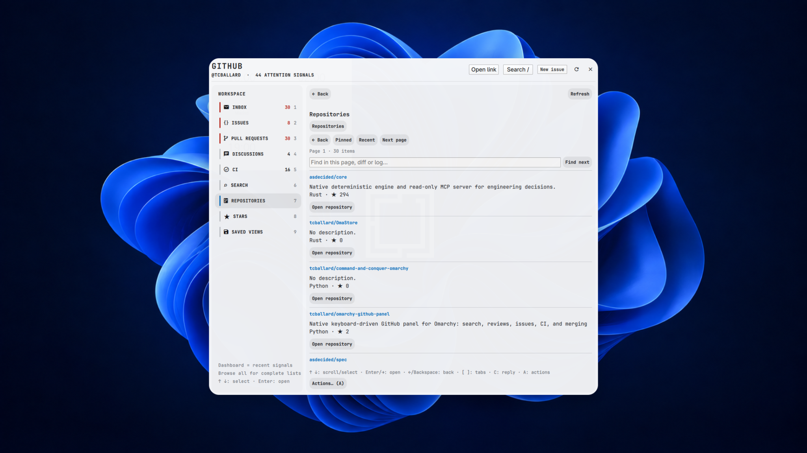

<h1 align="center">GitHub for Omarchy</h1>

<p align="center">
  <a href="https://github.com/tcballard/omarchy-badges"></a>
</p>

**Keep up with your repositories from your desktop.**

A native GitHub workspace for repositories, stars, notifications, issues, pull requests and CI. Read threads, review changes, resolve merge conflicts and manage releases using your existing GitHub CLI login.



*Running on Tom’s XPS with the Familiar theme. Screenshot supplied by Tom, 22 September 2026.*

## Everyday use

Browse your repositories and stars, check the dashboard, or search for an issue or pull request. Open its reader for discussion, changes, review threads and checks. Actions such as posting, reviewing or merging have explicit review and confirmation steps. [Keyboard controls →](GUIDE.md#keyboard) · [Workspace guide →](WORKSPACE_GUIDE.md)

## Install

[Available in the Omarchy Plugin Marketplace](https://plugins.omarchy.org/plugin.html?id=tcballard.github).

Omarchy with the Quickshell plugin API, Python 3, Git 2.38+ for conflict resolution and GitHub CLI authenticated with `gh auth login --hostname github.com`. Your login needs access to the repositories and notifications you use. Issue and workflow forms also use `python-yaml`.

```bash
omarchy plugin add https://github.com/tcballard/omarchy-github-panel.git --enable
```

## Update and remove

Update:

```bash
omarchy plugin update tcballard.github
```

Remove:

```bash
omarchy plugin remove tcballard.github
```

## Marketplace status

The marketplace-listed snapshot is **0.4.0**, commit [`54543d31f5363e5bd0c4eab2735272a6ace7a4a9`](https://github.com/tcballard/omarchy-github-panel/commit/54543d31f5363e5bd0c4eab2735272a6ace7a4a9), published and re-verified on **5 October 2026**. See the [review and publication record](https://github.com/omacom/omarchy-plugin-marketplace/issues/8159).

Automated verification applies only to that exact snapshot. It is not a security audit, a guarantee covering later changes, or evidence of live-desktop acceptance for the 0.4.0 changes.

Normal install and update commands follow the current upstream branch and are not pinned to the verified snapshot.

## A few useful details

Installation does not add a shortcut. Open the panel with `omarchy-shell shell summon tcballard.github`, or add your own binding.

Drafts, saved views and workspace data are stored locally per account. Removal keeps that data and your GitHub login. [Data and removal](GUIDE.md#install-and-update) · [Validation](VALIDATION.md)

Tested on Tom’s XPS with Familiar; all remaining local testing confirmed passed on 22 September 2026.

Derived from the Omarchy GitHub panel; the original MIT licence is retained.

[Usage and development guide](GUIDE.md) · [Report a bug](https://github.com/tcballard/omarchy-github-panel/issues)

[MIT licensed](LICENSE).

<!-- Preserve links to sections now in the guide. -->
<a id="031--bounded-github-cli-output"></a>
<a id="inline-code-review"></a>
<a id="install-and-update"></a>
<a id="keyboard"></a>
<a id="native-lifecycle-actions"></a>
<a id="search"></a>
<a id="verification"></a>

[Looking for the previous detailed sections? Open the full guide →](GUIDE.md)
